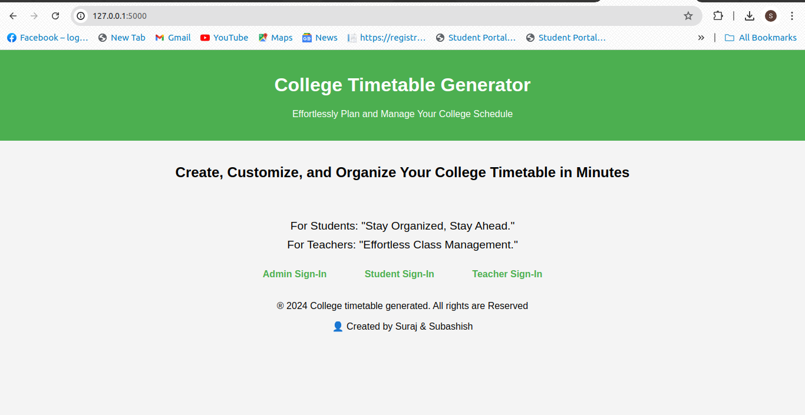

# College TimeTable Generated
Regular College timetable generated is a web application that enables Admin,Students and Professors to work efficently & get access to their daily schedule by
just visiting to this application.Admin has the highest privilege which takes control of the overall system by scheduling new timetable for students & professor, updating the 
existing timetable according to different circumstances.Futher it also manages in adding upcoming new courses professors in the department and prepare well organised 
and conflict free timetable for students leading to appropriate synchronization between students and professors.

## HomePage

# Functionalities of this application
## Authorized Access
only Authorized people can access this application that are legally associated to the organization ensuring privacy & Security to every individual.

## Appropriate privileges are allocated to every user of this application
Students and Professor can access timetable by using logging creditial that are asinged to them.
Admin can create,update and delete the different attributes in the timetable depending on the requirement.

## Admin
Create New Timetable for different semesters.
Intiate creation of new courses in Department.
Add new professor.
Schedule new lectures according to desired timeslots.
Different Constraints are added to prevent conflict of two lecture that are schedule.
And finally after all inputs a timetable gets generated in the form of pdf , that futher can be seen in student and Professor Dashboard.
ADMIN DASHBOARD

## Student & Professor
View Timetable generated by Admin in their respective dashboard.

# TechStack
### Python that uses Flask Framework.
### MYSQL DataBase
### HTML & CSS

# License
### Eclipse Public License (EPL)
